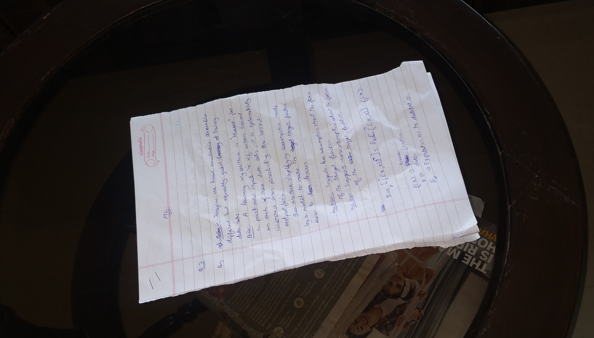

# autocrop_kh

#### Automatic Document Segmentation and Cropping for Khmer IDs, Passport and Documents

Autocrop_kh is a Python package for automatic document segmentation and cropping, with a focus on Khmer IDs, Passport and other documents. It uses a DeepLabV3 model training on Khmer ID, Passport document datasets to accurately segment and extract documents from images.

License: [Apache-2.0 License](https://github.com/MetythornPenn/sdab/blob/main/LICENSE)

## Installation

#### Install from source

```sh

# clone repo 
git clone https://github.com/MetythornPenn/autocrop_kh.git

# install lib from source
pip install -e .

```

#### Install from PyPI
```sh
pip install autocrop-kh
```

## Usage

#### Python Script

```python
import cv2
from autocrop_kh import autocrop

# Download sample image from this url : "https://github.com/MetythornPenn/autocrop_kh/raw/main/sample/img-1.jpg"
# Model auto-download (default):
# The ONNX model is downloaded on first run from Hugging Face:
# "https://huggingface.co/metythorn/autocrop/resolve/main/autocrop_model_v2.onnx"

img_path = "sample/img-1.jpg"
model_path = None

extracted_document = autocrop(
    img_path=img_path,
    model_path=model_path,
    device='cuda:0',
    output_path="extracted_document.jpg"
)

print("Extracted document saved to extracted_document.jpg")

```

- `img_path`: Path of the input image file.
- `model_path`: Path to the pre-trained ONNX model (local path, `.onnx` only). If `None`, it auto-downloads from Hugging Face.
- `device`: Specify `cpu` or `cuda` (default is `cpu`).
- `output_path`: Optional. If set, saves the extracted image to this path.
- `AUTOCROP_KH_MODEL_DIR`: Optional env var to change the download/cache directory.
- `AUTOCROP_KH_HF_REPO`: Optional env var to change the Hugging Face repo (default `metythorn/autocrop`).

#### Result:

<p align="center">
  
  
</p>

<p align="center">
  
  
</p>


**Noted** : This model was trained with 25000 datasets include opensource data and my custom synthetic data.
## Reference 
- Inspired by [DeepLabV3](https://paperswithcode.com/method/deeplabv3)
